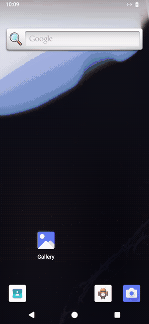

# Conferbot React Native SDK

[](https://www.npmjs.com/package/@conferbot/react-native)
[](https://reactnative.dev/)
[](https://www.typescriptlang.org/)
[](https://github.com/conferbot/react-native-sdk/blob/main/LICENSE)

Native React Native SDK for embedding Conferbot chatbots into iOS and Android applications - no WebView required.

## See it in action

The complete flow recorded live on an Android emulator against production: open the floating widget with its server-configured CTA tooltip, bot loads with server theming, welcome message with GIF below the text bubble, name captured through the inline input, choice selection with the transcript kept intact (selected pill stays highlighted, the rest disabled), and follow-up nodes.

<p align="center">
  
</p>

<p align="center"><a href="docs/demo.mp4">HD video (MP4)</a></p>

<p align="center">
  
  
  
</p>

## Features

- **Native Components** - Built entirely with React Native views, not a WebView wrapper
- **Floating Bubble (FAB)** - The same bottom-right chat bubble as the web widget, driven by your dashboard settings
- **Real-time Messaging** - Socket.IO-based communication with automatic reconnection
- **Node Flow Engine** - Renders the interactive flows you build in the Conferbot flow builder (choices, inputs, cards, and more)
- **Server-driven Theming** - Colors, bot name, and avatar configured in the dashboard apply automatically
- **Live Agent Handover** - Seamless transition between bot and human agents, with agent typing indicators
- **Offline Support** - Messages are queued locally and retried when connectivity returns
- **Session Persistence** - Conversations survive app restarts via AsyncStorage
- **Push Token Registration** - Register device tokens for background message delivery
- **Message Reactions** - Emoji reactions with real-time sync
- **Read Receipts** - Sent, delivered, and read status indicators
- **File Attachments** - Camera, gallery, and document picker support
- **Analytics** - Session, message, node, and custom event tracking
- **TypeScript** - Complete type definitions for every export

## Requirements

| Dependency     | Minimum Version |
|----------------|-----------------|
| React          | 17.0.0          |
| React Native   | 0.70.0          |
| iOS            | 12.0+           |
| Android        | API 21+         |

## Installation

```bash
npm install @conferbot/react-native
# or
yarn add @conferbot/react-native
```

### Peer Dependencies

The SDK itself is pure TypeScript - it has no native code of its own, so there is no linking step for the SDK package. Its runtime dependencies (`axios`, `socket.io-client`) are installed automatically.

Two peer dependencies are **optional** but unlock features:

```bash
# Session persistence + offline message queue
npm install @react-native-async-storage/async-storage

# Crisper vector icons in some components
npm install react-native-svg
```

Both of these are native modules, so after installing them run the usual native steps:

```bash
cd ios && pod install && cd ..
```

Without `@react-native-async-storage/async-storage`, the SDK still works - persistence and the offline queue are simply disabled.

## Getting Your API Key and Bot ID

1. **Log in** to the [Conferbot Dashboard](https://app.conferbot.com)
2. **Create or select a bot** from the dashboard
3. **Find your Bot ID**: Go to **Bot Settings** > **General** - the Bot ID is displayed at the top
4. **Find your API Key**: Go to **Workspace Settings** > **API Keys** - copy the key starting with `conf_`

> **No account yet?** The public demo bot `691c970890527a0468f9b2c9` works without an account - drop it in as `botId` to try the SDK immediately.

## Quick Start

### 1. Floating Bubble (recommended - like the web widget)

`ConferBotWidget` renders a floating chat bubble in the bottom-right corner of the screen, exactly like the Conferbot web widget. Tapping it opens the full chat modal. Overlay it on top of your existing screen - it positions itself absolutely.

```tsx
import React from 'react';
import { View, Text } from 'react-native';
import { ConferBotProvider, ConferBotWidget } from '@conferbot/react-native';

export default function App() {
  return (
    <ConferBotProvider apiKey="YOUR_API_KEY" botId="YOUR_BOT_ID">
      <View style={{ flex: 1 }}>
        <Text>Your app content</Text>
        <ConferBotWidget />
      </View>
    </ConferBotProvider>
  );
}
```

The bubble reads your dashboard settings automatically: FAB color (solid or gradient fallback), icon, size, position (left/right), offsets, border radius, and the CTA tooltip text shown next to the bubble. You do not need to write any styling code to match your web widget.

Every setting can also be overridden locally through `widgetConfig`. Local props win over server values:

```tsx
<ConferBotWidget
  title="Support Chat"
  placeholder="Type your message..."
  showTimestamps={true}
  widgetConfig={{
    position: 'right',
    offsetX: 16,
    offsetBottom: 24,
    size: 56,
    backgroundColor: '#1b55f3',
    iconColor: '#ffffff',
    ctaText: 'Chat with us!',
    showCta: true,
  }}
/>
```

`ConferBotWidgetProps` extends `ChatWidgetProps`, so anything the chat modal accepts (`title`, `placeholder`, `enableAttachments`, ...) can be passed straight through.

### 2. Drop-in ChatWidget

Render the full chat UI directly (it opens as a modal and auto-opens on first mount):

```tsx
import React from 'react';
import { ConferBotProvider, ChatWidget } from '@conferbot/react-native';

export default function App() {
  return (
    <ConferBotProvider apiKey="YOUR_API_KEY" botId="YOUR_BOT_ID">
      <ChatWidget />
    </ConferBotProvider>
  );
}
```

Control visibility yourself with the `visible` and `onClose` props:

```tsx
const [open, setOpen] = useState(false);

<ChatWidget visible={open} onClose={() => setOpen(false)} />
```

### 3. Headless (useConferBot Hook)

Full control over the UI - the hook exposes connection state, the message record, and all actions.

```tsx
import React from 'react';
import { View, Text, Button, FlatList } from 'react-native';
import { ConferBotProvider, useConferBot } from '@conferbot/react-native';

function ChatScreen() {
  const { sendMessage, record, isConnected } = useConferBot();

  return (
    <View style={{ flex: 1 }}>
      <Text>{isConnected ? 'Connected' : 'Connecting...'}</Text>
      <FlatList
        data={record}
        keyExtractor={(item) => String(item._id)}
        renderItem={({ item }) => <Text>{'text' in item ? item.text : item.type}</Text>}
      />
      <Button title="Send Hello" onPress={() => sendMessage('Hello!')} />
    </View>
  );
}

export default function App() {
  return (
    <ConferBotProvider apiKey="YOUR_API_KEY" botId="YOUR_BOT_ID">
      <ChatScreen />
    </ConferBotProvider>
  );
}
```

### 4. Mix and Match (Individual Components)

Compose the pre-built components inside your own layout:

```tsx
import React from 'react';
import { View } from 'react-native';
import {
  ConferBotProvider,
  useConferBot,
  MessageList,
  ChatInput,
  ChatHeader,
  ConnectionStatus,
} from '@conferbot/react-native';

function CustomChat() {
  const { record, sendMessage, currentAgent, isConnected } = useConferBot();

  return (
    <View style={{ flex: 1 }}>
      <ChatHeader title="Support" agent={currentAgent} />
      <ConnectionStatus variant="badge" />
      <MessageList messages={record} />
      <ChatInput onSend={sendMessage} disabled={!isConnected} />
    </View>
  );
}

export default function App() {
  return (
    <ConferBotProvider apiKey="YOUR_API_KEY" botId="YOUR_BOT_ID">
      <CustomChat />
    </ConferBotProvider>
  );
}
```

Other exported building blocks: `MessageBubble`, `Avatar`, `TypingIndicator`, `EmptyState`, `OfflineBanner`, `MessageStatusIndicator`, `ReactionPicker`, `MessageReactions`, `LinkPreview`, `EmojiPicker`, `NodeRenderer`.

## Configuration

### ConferBotProvider Props

```ts
interface ConferBotProviderProps {
  apiKey: string;
  botId: string;
  config?: ConferBotConfig;
  customization?: ConferBotCustomization;
  user?: ConferBotUser;
  children: React.ReactNode;
}
```

### ConferBotConfig

```tsx
import AsyncStorage from '@react-native-async-storage/async-storage';

<ConferBotProvider
  apiKey="YOUR_API_KEY"
  botId="YOUR_BOT_ID"
  config={{
    enableNotifications: true,
    enableOfflineMode: true,
    enablePersistence: true,
    asyncStorage: AsyncStorage,
    enableReadReceipts: true,
    autoConnect: true,
    reconnectionAttempts: 5,
    reconnectionDelay: 3000,
  }}
>
  {children}
</ConferBotProvider>
```

| Option                 | Type                     | Description                                                        |
|------------------------|--------------------------|--------------------------------------------------------------------|
| `enableNotifications`  | `boolean`                | Enable push notification support                                   |
| `enableOfflineMode`    | `boolean`                | Queue outbound messages while offline                              |
| `autoConnect`          | `boolean`                | Connect the socket on mount                                        |
| `reconnectionAttempts` | `number`                 | Max socket reconnection attempts                                   |
| `reconnectionDelay`    | `number`                 | Delay between reconnection attempts (ms)                           |
| `enablePersistence`    | `boolean`                | Persist sessions across app restarts (default true when `asyncStorage` is provided) |
| `asyncStorage`         | `AsyncStorageInterface`  | AsyncStorage instance for persistence and the offline queue        |
| `persistenceConfig`    | `PersistenceConfig`      | `maxMessages`, `keyPrefix`, `enabled`, `sessionExpiryMs`           |
| `enableReadReceipts`   | `boolean`                | Read receipt tracking (default: true)                              |
| `readReceiptConfig`    | `ReadReceiptConfig`      | `enabled`, `showIndicators`, `batchDebounceMs`, `autoMarkAsRead`   |
| `offlineQueueConfig`   | `OfflineQueueConfig`     | `maxQueueSize`, `maxRetries`, retry backoff, `persistQueue`, `autoProcess` |

## Passing User Identity

Identify the visitor so conversations and answer variables are attributed to a known user:

```tsx
<ConferBotProvider
  apiKey="YOUR_API_KEY"
  botId="YOUR_BOT_ID"
  user={{
    id: 'user_123',
    name: 'Jane Doe',
    email: 'jane@example.com',
    phone: '+15551234567',
    metadata: { plan: 'pro' },
  }}
>
  {children}
</ConferBotProvider>
```

`ConferBotUser` requires `id`; `name`, `email`, `phone`, and `metadata` are optional. With persistence enabled, the identified user is stored locally (`PersistedUser`) so returning visitors resume their session.

## Theming and Flow-Builder Customizations

### Server customizations apply automatically

Everything you configure in the Conferbot dashboard (Widget Customization / flow builder) is fetched at connect time and applied to the built-in chat UI without any code:

- **Colors**: header background/text, bot bubble, user bubble, option bubble, chat background, base font size
- **Identity**: bot name in the header (server `botName` wins over the local `title` prop), avatar image, tagline
- **Floating bubble**: FAB color or gradient, icon (SVG name or custom image), size, position, offsets, border radius, CTA text

### Precedence - be aware of how merging works

- **Floating bubble (`ConferBotWidget`)**: local `widgetConfig` props > server dashboard values > SDK defaults. Anything you set explicitly wins.
- **Chat UI inside `ChatWidget`**: the widget wraps its content in an internal `ThemeProvider` seeded with the server theme override, merged over the SDK's default theme. That means **server dashboard colors win over a local `ThemeProvider`** for the drop-in chat modal. If your dashboard has no customizations, the default light theme is used.
- **Components you compose yourself** (`MessageList`, `ChatHeader`, ... in a custom layout): styled by the nearest `ThemeProvider` you provide - fully under your control.
- The `customization` prop on `ConferBotProvider` (`ConferBotCustomization`) is accepted for forward compatibility but is **not applied to the built-in UI in v1.1.0**. Use dashboard customizations or `ThemeProvider` instead.

Note: React Native cannot render CSS gradients natively, so a gradient FAB theme from the dashboard falls back to the solid background color.

### Local themes

The SDK ships `defaultTheme` (light) and `darkTheme`. Wrap your own composed components in `ThemeProvider`:

```tsx
import { ThemeProvider, darkTheme } from '@conferbot/react-native';

<ThemeProvider theme={darkTheme}>
  <CustomChat />
</ThemeProvider>
```

`ThemeProvider` deep-merges the given `ConferBotThemeOverride` over `defaultTheme`, so partial overrides are fine:

```tsx
<ThemeProvider
  theme={{
    colors: {
      primary: '#4F46E5',
      userBubble: '#4F46E5',
      botBubble: '#F3F4F6',
    },
    borderRadius: { bubble: 12 },
  }}
>
  <CustomChat />
</ThemeProvider>
```

Read the active theme in your own components with `useTheme()`. The full token set (`colors`, `typography`, `spacing`, `borderRadius`, `shadows`, `animations`, `layout`) is defined in the `ConferBotTheme` type.

## Push Notifications

Register a device push token (from Firebase, APNs, or Expo) so the visitor can receive messages while the app is backgrounded. The SDK detects the platform automatically and posts to the Conferbot mobile API:

```tsx
const { registerPushToken } = useConferBot();

// After obtaining a token from your push provider:
await registerPushToken(deviceToken);
```

Obtaining the token itself (e.g. via `@react-native-firebase/messaging`) and displaying notifications is up to your app - the SDK only registers the token with Conferbot. There is currently no public unregister method.

## Offline Support

With `enableOfflineMode` and an `asyncStorage` instance, outbound messages are queued locally, persisted, and retried with exponential backoff once connectivity returns. Queue state is surfaced on the context:

```tsx
const {
  isOnline,
  pendingMessageCount,
  failedMessageCount,
  retryFailedMessage,
  retryAllFailedMessages,
  clearFailedMessages,
} = useConferBot();
```

The `OfflineBanner` component renders a ready-made "you are offline" banner, and `MessageStatusIndicator` shows per-message queued/failed states. For lower-level control there are `useNetworkStatus()` (returns `isConnected`, `isInternetReachable`, `type`, `refresh()`) and `useOfflineQueue()` (returns `queue`, `queueSize`, `pendingCount`, `failedCount`, `queueMessage`, `retryAllFailed`, `processQueue`, and more), plus the standalone `OfflineQueueService` class.

## Message Reactions

Users can react to messages with the built-in emoji set (`REACTION_EMOJIS`: 👍 👎 ❤️ 😊 😮 😢). Reactions sync in real time over the socket.

```tsx
const { addReaction, removeReaction, getReactions } = useConferBot();

addReaction(messageId, '👍');
```

`ReactionPicker` and `MessageReactions` handle rendering; the standalone `useReactions()` hook adds `toggleReaction`, `getGroupedReactions`, and `hasUserReacted` for custom UIs.

## Read Receipts

Sent / delivered / read statuses update in real time (enabled by default; tune with `config.readReceiptConfig`).

```tsx
const { getMessageStatus, markMessageAsRead, markVisibleMessagesAsRead } = useConferBot();
```

`MessageList` accepts `messageStatuses` and `showReadReceipts` props, and `MessageStatusIndicator` renders the tick marks.

## Knowledge Base

The public API surface for knowledge base in v1.1.0 is intentionally small:

- The `KnowledgeBaseArticle` type and the `rateKBArticle(articleId, helpful, rating, feedback?)` action on `useConferBot()`, which emits the `rate-article` socket event.
- Recent articles and categories arrive with the chatbot data payload (`FetchedChatbotDataResponse.knowledgeBaseData`).

Full knowledge base browsing screens (`KnowledgeBaseScreen`, `KBButton`, `ChatWidgetWithKB`) exist in the source tree under `src/components/KnowledgeBase/` but are **not exported from the package root yet** - unlike the Flutter SDK's `KnowledgeBaseScreen`. If you need them today, they are visible in the shipped `src/` folder, but treat them as unstable until they are officially exported.

## Analytics

Wrap your app with `ConferBotWithAnalyticsProvider` to get session, message, node, and drop-off tracking with batched uploads:

```tsx
import { ConferBotWithAnalyticsProvider, useAnalyticsContext } from '@conferbot/react-native';

<ConferBotWithAnalyticsProvider
  apiKey="YOUR_API_KEY"
  botId="YOUR_BOT_ID"
  config={{ enableAnalytics: true }}
  appVersion="1.4.2"
>
  <ChatWidget />
</ConferBotWithAnalyticsProvider>
```

Track custom events with the `useAnalytics()` hook:

```tsx
const { trackEvent, trackUserAction } = useAnalytics();
trackEvent('checkout_help_opened', { screen: 'checkout' });
```

## Socket Events

Subscribe to raw real-time events for advanced use cases. `on()` returns an unsubscribe function. Event names come from the `SocketEvents` enum (values are kebab-case strings such as `'bot-response'`):

```tsx
import { useConferBot, SocketEvents } from '@conferbot/react-native';

const { on } = useConferBot();

useEffect(() => {
  const unsubscribe = on(SocketEvents.BOT_RESPONSE, (data) => {
    console.log('Bot responded:', data);
  });
  return unsubscribe;
}, [on]);
```

Key server events: `BOT_RESPONSE`, `AGENT_MESSAGE`, `AGENT_ACCEPTED`, `AGENT_LEFT`, `AGENT_TYPING_STATUS`, `CHAT_ENDED`, `CONNECTION_ERROR`.

## Custom Endpoints

By default the SDK talks to production at `https://wdt.conferbot.com` (REST base `https://wdt.conferbot.com/api/v1/mobile`). Point it elsewhere (self-hosted, staging, or a local embed-server) before rendering the provider:

```tsx
import { ConferBotEndpoints } from '@conferbot/react-native';

ConferBotEndpoints.configure({
  socketUrl: 'https://your-server.example.com',
  apiBaseUrl: 'https://your-server.example.com/api/v1/mobile',
});
// ConferBotEndpoints.reset() restores the defaults
```

## API Reference

### Components

| Export | Key props (real signatures) | Description |
|--------|------------------------------|-------------|
| `ConferBotProvider` | `apiKey: string`, `botId: string`, `config?`, `customization?`, `user?` | Root provider - manages socket, session, persistence, and state (also the default export) |
| `ConferBotWithAnalyticsProvider` | provider props + `appVersion?`, `buildNumber?`, analytics `config` | Provider variant with analytics wired in |
| `ConferBotWidget` | `widgetConfig?: WidgetConfig` + all `ChatWidgetProps` | Floating bubble (FAB) + chat modal, web-widget style |
| `ChatWidget` | `visible?`, `onClose?`, `title?`, `placeholder?`, `enableAttachments?`, `enableVoiceMessage?`, `showTimestamps?`, `closeOnBackdrop?`, `typingDelay?`, `voiceMaxDuration?`, `voiceMinDuration?`, `debug?`, `testID?` | Drop-in full-screen chat modal with node flow engine |
| `ChatHeader` | `title?`, `tagline?`, `subtitle?`, `agent?: Agent`, `botAvatarUrl?`, `showConnectionStatus?`, `onClose?`, `rightActions?` | Chat header with avatar, agent info, connection dot |
| `MessageList` | `messages: RecordItem[]`, `showTypingIndicator?`, `showTimestamps?`, `reactions?`, `messageStatuses?`, `activeNodeUI?`, `onNodeSubmit?`, `onEndReached?` | Virtualized message list with inline node rendering |
| `MessageBubble` | see `MessageBubbleProps` | Single message bubble (user/bot/agent/system) |
| `ChatInput` | `onSend: (text: string) => void \| Promise<void>`, `placeholder?`, `disabled?`, `enableAttachments?`, `enableVoiceMessage?`, `enableEmoji?`, `maxLength?`, `onTyping?` | Text input bar with attachments, emoji, voice |
| `ConnectionStatus` | see `ConnectionStatusProps` | Connection state banner/indicator |
| `TypingIndicator`, `Avatar`, `EmptyState` | see respective `*Props` | Small building blocks |
| `OfflineBanner` | see `OfflineBannerProps` | "You are offline" banner |
| `MessageStatusIndicator` | see `MessageStatusProps` | Sent/delivered/read/queued tick marks |
| `ReactionPicker`, `MessageReactions` | see respective `*Props` | Emoji reaction picker and reaction chips |
| `LinkPreview` | see `LinkPreviewProps` | URL preview card |
| `EmojiPicker` (+ `EmojiButton`, `EmojiGrid`, ...) | see respective `*Props` | Full emoji picker with search and skin tones |
| `NodeRenderer` | internal node UI | Renders interactive flow nodes |
| `ThemeProvider` | `theme?: ConferBotThemeOverride` | Deep-merges an override over `defaultTheme` |

### Hooks

| Hook | Returns | Description |
|------|---------|-------------|
| `useConferBot()` | full context (below) | Main headless API - state + actions |
| `useTheme()` | `ConferBotTheme` | Active theme tokens |
| `useAnalytics(options?)` | `trackEvent`, `trackUserAction`, `trackNodeVisit`, `trackUserMessage`, ... | Event tracking |
| `useNetworkStatus(options?)` | `isConnected`, `isInternetReachable`, `type`, `isLoading`, `refresh()` | Connectivity state |
| `useOfflineQueue(options)` | `isOnline`, `queue`, `queueSize`, `pendingCount`, `failedCount`, `queueMessage`, `retryMessage`, `retryAllFailed`, `clearQueue`, `processQueue`, ... | Offline queue control |
| `useReactions(...)` | `reactions`, `addReaction`, `removeReaction`, `toggleReaction`, `getGroupedReactions`, `hasUserReacted` | Reaction state |
| `useReadReceipts(options)` | see `UseReadReceiptsReturn` | Read receipt tracking |
| `usePersistence()` / `useDebouncedPersistence()` | see `UsePersistenceReturn` | Storage helpers |

### useConferBot() - state and actions

State: `isInitialized`, `isConnected`, `isOpen`, `chatSessionId?`, `unreadCount`, `currentAgent?: Agent`, `record: RecordItem[]`, `chatbotConfig?`, `reactions: Map<string, Reaction[]>`, `isRestoring`, `hasPersistedSession`, `messageStatuses`, `readReceiptsEnabled`, `isOnline`, `pendingMessageCount`, `failedMessageCount`, `serverCustomizations`, `botName`, `botAvatarUrl`, `currentUIState`, `isNodeProcessing`, `isLiveChatMode`, `agentTyping`.

Actions:

| Method | Signature | Description |
|--------|-----------|-------------|
| `openChat` / `closeChat` | `() => void` | Toggle the open state / reset unread count |
| `sendMessage` | `(text: string, attachments?: MessageAttachment[]) => Promise<void>` | Send a visitor message |
| `submitNodeResponse` | `(response: any, portName?: string) => void` | Answer the active interactive flow node |
| `registerPushToken` | `(token: string) => Promise<void>` | Register a device push token |
| `on` / `off` | `(event: SocketEvents, cb: (...args: any[]) => void) => () => void` | Subscribe to socket events (`on` returns unsubscribe) |
| `addReaction` / `removeReaction` | `(messageId: string, emoji: ReactionEmoji) => void` | React to a message |
| `getReactions` | `(messageId: string) => Reaction[]` | Read reactions for a message |
| `getMessageStatus` | `(messageId: string \| number) => MessageStatus \| undefined` | Read receipt status |
| `markMessageAsRead` / `markVisibleMessagesAsRead` | `(id) => void` / `(ids) => void` | Mark inbound messages read |
| `retryFailedMessage` | `(messageId: string) => Promise<boolean>` | Retry one queued message |
| `retryAllFailedMessages` / `clearFailedMessages` | `() => Promise<number>` | Bulk queue operations |
| `clearPersistedData` / `resetConversation` | `() => Promise<void>` | Wipe stored session / start fresh |
| `rateKBArticle` | `(articleId: string, helpful: boolean, rating: number, feedback?: string) => void` | Rate a knowledge base article |
| `sendVisitorTyping` | `(isTyping: boolean) => void` | Emit visitor typing status |

### Utilities and services

| Export | Description |
|--------|-------------|
| `ConferBotEndpoints` | `configure({ apiBaseUrl?, socketUrl? })` / `reset()` - endpoint overrides |
| `StorageService` | Session/user persistence over any `AsyncStorageInterface` |
| `OfflineQueueService` | Persistent retry queue with exponential backoff |
| `LinkPreviewService` / `linkPreviewService` | URL metadata fetching with cache |
| `AnalyticsService`, `getAnalyticsService()` | Batched analytics uploads |
| `FilePicker`, `formatFileSize`, `isFilePickerAvailable`, ... | Document/image/camera picking helpers |
| `detectUrls`, `parseTextForUrls`, `extractDomain`, ... | Link detection utilities |
| `NodeFlowEngine`, `ChatState`, `NodeHandlerRegistry`, `NodeTypes`, `registerAllHandlers` | Node flow engine internals for advanced use |
| `defaultTheme`, `darkTheme` | Built-in themes |
| `SocketEvents`, `MessageStatus`, `REACTION_EMOJIS` | Enums and constants |

## Troubleshooting

**The bot does not appear / chat stays empty**
- Confirm the bot is **published** in the dashboard - unpublished bots return no flow.
- Double-check the `botId` (Bot Settings > General). A wrong ID fails silently with an empty widget.
- Verify `https://wdt.conferbot.com` is reachable from the device/emulator (corporate proxies and emulator DNS are the usual suspects).
- Try the public demo bot `691c970890527a0468f9b2c9`, which works without an account - if it loads, the problem is your bot configuration, not the SDK.

**Socket never connects against a local server**
- Android emulators reach your host machine at `10.0.2.2`, not `localhost`.
- Plain `http://` targets require `android:usesCleartextTraffic="true"` (Android) or an ATS exception (iOS) in the example/native app.

**Sessions do not persist / offline queue does nothing**
- Install `@react-native-async-storage/async-storage` and pass it as `config.asyncStorage`. Without it these features are disabled by design.

**Dashboard colors are not showing up**
- Server customizations arrive with the chatbot data on connect - if the socket is not connected, the default theme is used. Also note server values intentionally override local themes inside the drop-in `ChatWidget` (see Theming above).

**Stale build issues**
- Reset Metro: `npx react-native start --reset-cache`, and rebuild the app after adding native peer dependencies.

## Example App

A fully working example app lives in [`example/`](example/) with a tab bar demonstrating all three integration patterns (Widget, Headless, Custom) plus the floating bubble.

```bash
# 1. Clone the repo
git clone https://github.com/conferbot/react-native-sdk.git
cd react-native-sdk

# 2. Build the SDK
npm install
npm run build

# 3. Set up the example app (installs deps, generates native projects)
cd example
./setup.sh

# 4. Configure credentials - open example/App.tsx and replace:
#      const API_KEY = 'test_key';
#      const BOT_ID = '69e8503cf33718a92ea792fe';
#    with your own values (or the public demo bot 691c970890527a0468f9b2c9).

# 5. Point at production - remove the ConferBotEndpoints.configure({...}) block
#    at the top of App.tsx. It targets a local embed-server (http://10.0.2.2:8001)
#    by default; without it the SDK uses https://wdt.conferbot.com.

# 6. Run on Android
npx react-native run-android

# 7. Or on iOS
cd ios && pod install && cd ..
npx react-native run-ios
```

| Tab | Pattern | Description |
|-----|---------|-------------|
| **Widget** | Floating bubble | `ConferBotWidget` FAB in the corner opening the chat modal |
| **Headless** | Hook-based | Custom UI with `useConferBot()` for full control |
| **Custom** | Mix & match | Pre-built components (`MessageList`, `ChatInput`) in a custom layout |

## Documentation

- [docs/USAGE.md](docs/USAGE.md) - Step-by-step integration tutorial
- [docs/API.md](docs/API.md) - Full API reference
- [docs/COMPONENTS.md](docs/COMPONENTS.md) - Component catalog
- [docs/ARCHITECTURE.md](docs/ARCHITECTURE.md) - SDK architecture overview
- [docs/EXAMPLES.md](docs/EXAMPLES.md) - Additional code examples

## Development

```bash
npm install           # Install dependencies
npm run build         # Compile TypeScript to lib/
npm run watch         # Watch mode
npm run lint          # ESLint
npm run type-check    # tsc --noEmit
npm test              # Jest tests
npm run test:coverage # Tests with coverage report
```

## Contributing

Contributions are welcome. Please open an issue first to discuss what you would like to change, then submit a pull request.

1. Fork the repository
2. Create a feature branch (`git checkout -b feature/my-change`)
3. Commit your changes
4. Push to your fork and open a pull request

## License

Apache 2.0 - see [LICENSE](LICENSE) for details.

## Links

- [Full Documentation](https://docs.conferbot.com/mobile/react-native)
- [GitHub Issues](https://github.com/conferbot/react-native-sdk/issues)
- [Conferbot Website](https://www.conferbot.com)
- [Support](mailto:support@conferbot.com)
