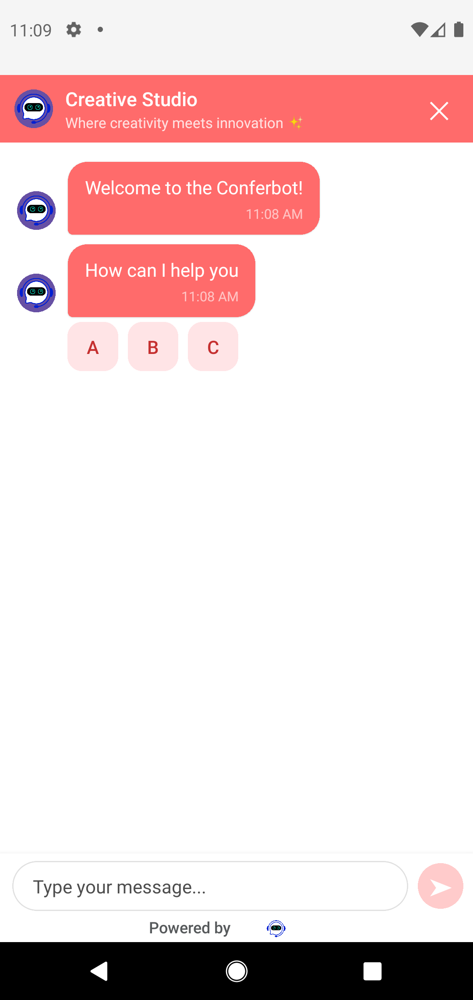

# Conferbot React Native SDK - Usage Guide

A step-by-step walkthrough for integrating `@conferbot/react-native` (v1.1.0) into a React Native app, from a blank project to a fully themed, offline-capable chat with live agent handover.

Everything below compiles against the real SDK API. When a feature is not part of the public API yet, this guide says so.

## Table of Contents

1. [Prerequisites](#1-prerequisites)
2. [Install the SDK](#2-install-the-sdk)
3. [Get your credentials](#3-get-your-credentials)
4. [Step 1 - Add the floating chat bubble](#4-step-1---add-the-floating-chat-bubble)
5. [Step 2 - Customize the bubble](#5-step-2---customize-the-bubble)
6. [Step 3 - Identify your user](#6-step-3---identify-your-user)
7. [Step 4 - Enable persistence and offline mode](#7-step-4---enable-persistence-and-offline-mode)
8. [Step 5 - Register for push notifications](#8-step-5---register-for-push-notifications)
9. [Step 6 - React to chat events](#9-step-6---react-to-chat-events)
10. [Step 7 - Theming](#10-step-7---theming)
11. [Step 8 - Build a fully custom chat screen (headless)](#11-step-8---build-a-fully-custom-chat-screen-headless)
12. [Step 9 - Analytics](#12-step-9---analytics)
13. [Working with interactive flow nodes](#13-working-with-interactive-flow-nodes)
14. [Knowledge base](#14-knowledge-base)
15. [Custom endpoints and local development](#15-custom-endpoints-and-local-development)
16. [Running the example app](#16-running-the-example-app)
17. [Troubleshooting](#17-troubleshooting)

---

## 1. Prerequisites

- React >= 17, React Native >= 0.70 (bare or Expo with dev client)
- iOS 12+ / Android API 21+
- A Conferbot account with a **published** bot (or use the public demo bot `691c970890527a0468f9b2c9`, which works without an account)

## 2. Install the SDK

```bash
npm install @conferbot/react-native
```

The SDK is pure TypeScript - no native code of its own, no linking, no pod install required for the SDK package itself. Its dependencies (`axios`, `socket.io-client`) are plain JavaScript.

Optional peer dependencies (both are native modules - rebuild the app after adding them):

```bash
# Required for session persistence and the offline queue
npm install @react-native-async-storage/async-storage

# Nicer SVG icons in some components
npm install react-native-svg

cd ios && pod install && cd ..
```

If you skip AsyncStorage the SDK still works; persistence and offline queuing are simply disabled.

## 3. Get your credentials

1. Log in to the [Conferbot Dashboard](https://app.conferbot.com)
2. Create or select a bot, then **publish** it
3. Bot ID: **Bot Settings > General** (shown at the top)
4. API key: **Workspace Settings > API Keys** (starts with `conf_`)

## 4. Step 1 - Add the floating chat bubble

The fastest integration mirrors the web widget: a floating action button (FAB) in the bottom-right corner that opens the chat modal. Wrap your app in `ConferBotProvider` and drop `ConferBotWidget` anywhere inside your root view - it positions itself absolutely.

```tsx
// App.tsx
import React from 'react';
import { SafeAreaView, Text } from 'react-native';
import { ConferBotProvider, ConferBotWidget } from '@conferbot/react-native';

export default function App() {
  return (
    <ConferBotProvider apiKey="conf_xxxxxxxx" botId="YOUR_BOT_ID">
      <SafeAreaView style={{ flex: 1 }}>
        <Text>Your app content</Text>

        {/* FAB bottom-right, opens the chat modal on tap */}
        <ConferBotWidget />
      </SafeAreaView>
    </ConferBotProvider>
  );
}
```

Run it:

```bash
npx react-native run-android   # or run-ios
```

That is the whole integration. On mount the provider connects to `https://wdt.conferbot.com` over Socket.IO, fetches the bot flow and dashboard customizations, and the bubble renders with your configured color, icon, position, and CTA tooltip.

## 5. Step 2 - Customize the bubble

`ConferBotWidget` accepts two groups of props:

- everything `ChatWidget` accepts (`title`, `placeholder`, `enableAttachments`, `enableVoiceMessage`, `showTimestamps`, `closeOnBackdrop`, `typingDelay`, `voiceMaxDuration`, `voiceMinDuration`, `debug`, `testID`, `onClose`)
- `widgetConfig: WidgetConfig` for the bubble itself

```tsx
<ConferBotWidget
  title="Support Chat"
  placeholder="Type your message..."
  showTimestamps={true}
  widgetConfig={{
    position: 'right',        // 'left' | 'right'
    offsetX: 16,              // px from edge
    offsetBottom: 24,         // px from bottom
    size: 56,                 // FAB diameter
    borderRadius: 28,         // defaults to size / 2 (circular)
    backgroundColor: '#1b55f3',
    themeType: 'solid',       // 'solid' | 'gradient'
    iconName: 'WidgetBubbleIcon1', // web-widget icon names
    iconImageUrl: undefined,  // custom image overrides SVG icon
    iconColor: '#ffffff',
    iconScale: 0.6,           // icon size relative to the button
    ctaText: 'Chat with us!', // tooltip beside the bubble
    showCta: true,
    showShadow: true,
  }}
/>
```

**Resolution order for every value: local prop > server dashboard setting > SDK default.** Leave `widgetConfig` empty to be fully server-driven, so marketing can restyle the bubble from the dashboard without an app release.

Two platform notes:

- React Native cannot render CSS gradients natively; a gradient theme from the dashboard falls back to the solid background color.
- The chat itself opens in a full-screen `Modal` (slide animation), matching mobile UX rather than the web popover.

## 6. Step 3 - Identify your user

Pass a `ConferBotUser` so conversations are attributed to a known person instead of an anonymous visitor:

```tsx
<ConferBotProvider
  apiKey="conf_xxxxxxxx"
  botId="YOUR_BOT_ID"
  user={{
    id: 'user_123',            // required
    name: 'Jane Doe',
    email: 'jane@example.com',
    phone: '+15551234567',
    metadata: { plan: 'pro', signupDate: '2026-01-15' },
  }}
>
  ...
</ConferBotProvider>
```

With persistence enabled (next step), the user is stored locally as `PersistedUser` and returning visitors resume the same session.

## 7. Step 4 - Enable persistence and offline mode

```tsx
import AsyncStorage from '@react-native-async-storage/async-storage';

<ConferBotProvider
  apiKey="conf_xxxxxxxx"
  botId="YOUR_BOT_ID"
  config={{
    // Persistence - chat history survives app restarts
    enablePersistence: true,          // default true when asyncStorage is provided
    asyncStorage: AsyncStorage,
    persistenceConfig: {
      maxMessages: 100,               // default 100
      sessionExpiryMs: 7 * 24 * 60 * 60 * 1000, // default 7 days
      keyPrefix: '@conferbot',        // storage namespace
    },

    // Offline queue - outbound messages retry automatically
    enableOfflineMode: true,
    offlineQueueConfig: {
      maxQueueSize: 50,
      maxRetries: 5,
      initialRetryDelay: 1000,
      maxRetryDelay: 30000,
      backoffMultiplier: 2,
      persistQueue: true,
      autoProcess: true,
    },

    // Connection behavior
    autoConnect: true,
    reconnectionAttempts: 5,
    reconnectionDelay: 3000,

    // Read receipts (on by default)
    enableReadReceipts: true,
    readReceiptConfig: { autoMarkAsRead: true, batchDebounceMs: 500 },
  }}
>
  ...
</ConferBotProvider>
```

Surface the offline state to your users. Inside the drop-in widget this is handled for you; in custom UIs use the context:

```tsx
import { useConferBot, OfflineBanner } from '@conferbot/react-native';

function QueueStatus() {
  const {
    isOnline,
    pendingMessageCount,
    failedMessageCount,
    retryAllFailedMessages,
  } = useConferBot();

  if (isOnline && failedMessageCount === 0) return null;

  return (
    <>
      <OfflineBanner isOffline={!isOnline} pendingCount={pendingMessageCount} />
      {failedMessageCount > 0 && (
        <Button
          title={`Retry ${failedMessageCount} failed`}
          onPress={() => retryAllFailedMessages()}
        />
      )}
    </>
  );
}
```

To wipe local state (e.g. on logout):

```tsx
const { clearPersistedData, resetConversation } = useConferBot();
await clearPersistedData();   // remove stored session/user
await resetConversation();    // start a fresh conversation
```

## 8. Step 5 - Register for push notifications

The SDK registers device tokens with Conferbot; obtaining the token and displaying notifications remain your app's job (e.g. `@react-native-firebase/messaging`).

```tsx
import messaging from '@react-native-firebase/messaging';
import { useConferBot } from '@conferbot/react-native';

function PushRegistration() {
  const { registerPushToken, isInitialized } = useConferBot();

  useEffect(() => {
    if (!isInitialized) return;
    (async () => {
      await messaging().requestPermission();
      const token = await messaging().getToken();
      await registerPushToken(token); // platform (ios/android) detected automatically
    })();
  }, [isInitialized]);

  return null;
}
```

Also set `config.enableNotifications: true` on the provider. There is currently no public unregister method - if you need token cleanup on logout, track it server-side.

## 9. Step 6 - React to chat events

`useConferBot().on()` subscribes to raw socket events and returns an unsubscribe function. Use the `SocketEvents` enum - the values are kebab-case strings (`'bot-response'`, not `'bot_response'`).

```tsx
import { useEffect } from 'react';
import { useConferBot, SocketEvents } from '@conferbot/react-native';

function ChatEventLogger() {
  const { on } = useConferBot();

  useEffect(() => {
    const subs = [
      on(SocketEvents.BOT_RESPONSE, (data) => console.log('bot:', data)),
      on(SocketEvents.AGENT_ACCEPTED, ({ agentDetails }) =>
        console.log('agent joined:', agentDetails.name)
      ),
      on(SocketEvents.AGENT_MESSAGE, (data) => console.log('agent msg:', data)),
      on(SocketEvents.CHAT_ENDED, () => console.log('chat ended')),
      on(SocketEvents.CONNECTION_ERROR, (err) => console.warn('socket error', err)),
    ];
    return () => subs.forEach((unsub) => unsub());
  }, [on]);

  return null;
}
```

Higher-level state is available without event wiring: `isConnected`, `isLiveChatMode`, `agentTyping`, `currentAgent`, `unreadCount` all live on the context and re-render your components automatically.

## 10. Step 7 - Theming

### How server and local themes interact (important)

1. **Dashboard customizations always apply to the drop-in `ChatWidget`.** On connect, the SDK converts dashboard settings into a theme override (header colors, bot/user/option bubble colors, chat background, base font size) and merges it over the default theme *inside* the widget. The bot name and avatar from the dashboard also take precedence over your local `title` prop.
2. **Server wins over local for the drop-in widget.** `ChatWidget` wraps its content in its own internal `ThemeProvider`, so an outer `ThemeProvider` you add does not restyle the drop-in chat UI. This is deliberate: the dashboard is the single source of truth for the branded widget, matching web behavior.
3. **Local `ThemeProvider` is for components you compose yourself.** In a mix-and-match or headless layout, the nearest `ThemeProvider` fully controls styling.
4. The `customization` prop on `ConferBotProvider` exists in the type surface but is **not applied to the built-in UI in v1.1.0**. Prefer dashboard customizations or `ThemeProvider`.

### Local theming for custom layouts

```tsx
import { ThemeProvider, darkTheme, useTheme } from '@conferbot/react-native';

// Built-in dark theme
<ThemeProvider theme={darkTheme}>
  <CustomChat />
</ThemeProvider>

// Partial override - deep-merged over defaultTheme
<ThemeProvider
  theme={{
    colors: {
      primary: '#4F46E5',
      userBubble: '#4F46E5',
      userBubbleText: '#FFFFFF',
      botBubble: '#F3F4F6',
      background: '#FFFFFF',
    },
    typography: { fontSize: { md: 16 } },
    borderRadius: { bubble: 12 },
  }}
>
  <CustomChat />
</ThemeProvider>
```

Inside any descendant, read tokens with `useTheme()`:

```tsx
function Bubble({ children }: { children: React.ReactNode }) {
  const theme = useTheme();
  return (
    <View style={{ backgroundColor: theme.colors.botBubble, borderRadius: theme.borderRadius.bubble }}>
      {children}
    </View>
  );
}
```

If you want to reuse the exact server colors in your own custom UI, they are exposed raw on the context as `serverCustomizations` and pre-mapped as `serverThemeOverride`:

```tsx
const { serverThemeOverride, botName, botAvatarUrl } = useConferBot();

<ThemeProvider theme={serverThemeOverride ?? undefined}>
  <CustomChat />
</ThemeProvider>
```

## 11. Step 8 - Build a fully custom chat screen (headless)

Everything the drop-in widget does is available through `useConferBot()`. Here is a complete custom screen that handles plain messages, interactive flow nodes, typing, and live agent handover state:

```tsx
import React from 'react';
import { View, Text, FlatList, StyleSheet } from 'react-native';
import {
  ConferBotProvider,
  useConferBot,
  ChatHeader,
  ChatInput,
  TypingIndicator,
  NodeRenderer,
  OfflineBanner,
} from '@conferbot/react-native';
import type { RecordItem } from '@conferbot/react-native';

function CustomChatScreen() {
  const {
    record,               // RecordItem[] - full transcript
    sendMessage,          // (text, attachments?) => Promise<void>
    isConnected,
    currentAgent,         // Agent | undefined - set during live handover
    agentTyping,
    isNodeProcessing,
    currentUIState,       // active interactive node, or null
    submitNodeResponse,   // answer the active node
    sendVisitorTyping,
    isOnline,
    botName,
    botAvatarUrl,
  } = useConferBot();

  const renderItem = ({ item }: { item: RecordItem }) => {
    const isUser = item.type === 'user-message' || item.type === 'user-input-response';
    const text = 'text' in item ? item.text : undefined;
    if (!text) return null;
    return (
      <View style={[styles.bubble, isUser ? styles.user : styles.bot]}>
        <Text style={isUser ? styles.userText : styles.botText}>{text}</Text>
      </View>
    );
  };

  return (
    <View style={{ flex: 1 }}>
      <ChatHeader
        title={botName ?? 'Chat'}
        agent={currentAgent}
        botAvatarUrl={botAvatarUrl ?? undefined}
        showConnectionStatus={true}
      />
      <OfflineBanner isOffline={!isOnline} />
      <FlatList
        data={record}
        keyExtractor={(item) => String(item._id)}
        renderItem={renderItem}
        contentContainerStyle={{ padding: 12 }}
      />
      <TypingIndicator isTyping={agentTyping || isNodeProcessing} />
      {currentUIState && (
        <NodeRenderer
          uiState={currentUIState}
          onSubmit={submitNodeResponse}
          isLoading={isNodeProcessing}
        />
      )}
      <ChatInput
        onSend={sendMessage}
        onTyping={sendVisitorTyping}
        disabled={!isConnected}
        placeholder="Type a message..."
      />
    </View>
  );
}

const styles = StyleSheet.create({
  bubble: { padding: 10, borderRadius: 14, marginVertical: 4, maxWidth: '80%' },
  user: { alignSelf: 'flex-end', backgroundColor: '#1b55f3' },
  bot: { alignSelf: 'flex-start', backgroundColor: '#F3F4F6' },
  userText: { color: '#fff' },
  botText: { color: '#111' },
});

export default function App() {
  return (
    <ConferBotProvider apiKey="conf_xxxxxxxx" botId="YOUR_BOT_ID">
      <CustomChatScreen />
    </ConferBotProvider>
  );
}
```

The transcript is a discriminated union - switch on `item.type` (`'bot-message'`, `'user-message'`, `'user-input-response'`, `'agent-message'`, `'agent-message-file'`, `'agent-message-audio'`, `'agent-joined-message'`, `'system-message'`, ...) for full fidelity rendering. The prebuilt `MessageList` component already handles all of these plus reactions, read receipts, and inline node rendering if you would rather not.

### Reactions and read receipts in custom UIs

```tsx
const {
  addReaction, removeReaction, getReactions,          // reactions
  getMessageStatus, markVisibleMessagesAsRead,        // read receipts
} = useConferBot();

addReaction(String(message._id), '👍');
const status = getMessageStatus(message._id);          // MessageStatus enum
```

`MessageList` accepts `reactions`, `onReactionPress`, `messageStatuses`, `showReadReceipts`, and `onVisibleMessagesChange` props to wire these up declaratively.

## 12. Step 9 - Analytics

Swap the provider for `ConferBotWithAnalyticsProvider` to track sessions, messages, node visits, and drop-offs with batched uploads:

```tsx
import {
  ConferBotWithAnalyticsProvider,
  useAnalytics,
} from '@conferbot/react-native';

export default function App() {
  return (
    <ConferBotWithAnalyticsProvider
      apiKey="conf_xxxxxxxx"
      botId="YOUR_BOT_ID"
      config={{ enableAnalytics: true }}
      appVersion="2.3.0"
      buildNumber="145"
    >
      <ConferBotWidget />
    </ConferBotWithAnalyticsProvider>
  );
}

// Anywhere below the provider:
function CheckoutHelp() {
  const { trackEvent, trackUserAction } = useAnalytics();
  return (
    <Button
      title="Need help?"
      onPress={() => trackEvent('help_opened', { screen: 'checkout' })}
    />
  );
}
```

## 13. Working with interactive flow nodes

Flows built in the Conferbot flow builder (choice buttons, text/email/phone inputs, ratings, cards, etc.) are executed on-device by the SDK's `NodeFlowEngine`. In the drop-in widget this is invisible - nodes just render inline. In headless mode:

- `currentUIState` (a `NodeUIState`) describes the node currently awaiting user input, or `null`
- `submitNodeResponse(response, portName?)` answers it and advances the flow
- `isNodeProcessing` is true while the engine works
- `NodeRenderer` renders any node type for you if you do not want to draw custom node UIs

Advanced users can access `NodeFlowEngine`, `ChatState`, `NodeHandlerRegistry`, `NodeTypes`, and `registerAllHandlers` directly from the package root.

## 14. Knowledge base

What is public in v1.1.0:

- `KnowledgeBaseArticle` type
- Recent articles and categories delivered with the chatbot data payload (`FetchedChatbotDataResponse.knowledgeBaseData`)
- `rateKBArticle(articleId, helpful, rating, feedback?)` on `useConferBot()`, emitting the `rate-article` socket event

```tsx
const { rateKBArticle } = useConferBot();
rateKBArticle('article_id', true, 5, 'Solved my problem');
```

What is **not** public yet: the full browsing UI (`KnowledgeBaseScreen`, `KBButton`, `ChatWidgetWithKB`) exists in the source tree (`src/components/KnowledgeBase/`) but is not exported from the package root, unlike the Flutter SDK's `KnowledgeBaseScreen`. Treat those components as unstable until they are officially exported.

## 15. Custom endpoints and local development

The SDK defaults to production: socket `https://wdt.conferbot.com`, REST `https://wdt.conferbot.com/api/v1/mobile`. Override *before* the provider mounts:

```tsx
import { ConferBotEndpoints } from '@conferbot/react-native';

// Self-hosted / staging
ConferBotEndpoints.configure({
  socketUrl: 'https://chat.your-domain.com',
  apiBaseUrl: 'https://chat.your-domain.com/api/v1/mobile',
});

// Local embed-server from the Android emulator (10.0.2.2 = host machine)
ConferBotEndpoints.configure({
  socketUrl: 'http://10.0.2.2:8001',
  apiBaseUrl: 'http://10.0.2.2:8001/api/v1/mobile',
});

// Back to defaults
ConferBotEndpoints.reset();
```

For plain `http://` targets during development, allow cleartext traffic (`android:usesCleartextTraffic="true"` on Android, an ATS exception on iOS).

## 16. Running the example app

The [`example/`](../example/) app shows a tab bar with all three integration patterns plus the floating bubble.

```bash
git clone https://github.com/conferbot/react-native-sdk.git
cd react-native-sdk
npm install && npm run build

cd example
./setup.sh                      # installs deps, generates native projects

# Edit example/App.tsx:
#  - replace API_KEY / BOT_ID with your credentials
#  - delete the ConferBotEndpoints.configure({...}) block to use production

npx react-native run-android    # or:
cd ios && pod install && cd .. && npx react-native run-ios
```

Screens to compare against:

<p align="center">
  
  
  
</p>

## 17. Troubleshooting

| Symptom | Fix |
|---------|-----|
| Bot never appears / empty chat | Bot must be **published**; verify `botId`; confirm `https://wdt.conferbot.com` is reachable from the device. Sanity-check with the public demo bot `691c970890527a0468f9b2c9` (works without an account). |
| Socket fails against local server | Use `10.0.2.2` (not `localhost`) from the Android emulator; allow cleartext HTTP in dev builds. |
| History does not persist / offline queue inert | Install `@react-native-async-storage/async-storage` and pass it as `config.asyncStorage`. |
| Dashboard colors not applied | Customizations arrive on socket connect; check connectivity. Remember server values override local themes inside the drop-in `ChatWidget`. |
| `on('bot_response')` never fires | Event names are kebab-case; use the `SocketEvents` enum (`SocketEvents.BOT_RESPONSE` = `'bot-response'`). |
| Weird build errors after adding peer deps | `npx react-native start --reset-cache`, then rebuild the native app. |

Still stuck? [Open an issue](https://github.com/conferbot/react-native-sdk/issues) or email [support@conferbot.com](mailto:support@conferbot.com).
